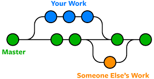

Git & GitHub – Core Commands
==============================

## Workflow: create → track → commit

### 1) Create & Initialize Project
    -  git init "folder_name"
------------------------------

### 2) Create Project Files
    -    touch README.md
    -    touch main.py
-----------------------------

### 3) Check Repository Status
    -    git status
-----------------------------

### 4) Stage Files
    -    git add .
    -    git add README.md     #(Or stage specific files)
-----------------------------

### 5) Commit Changes
    -    git commit -m"Initialize project structure"
-----------------------------

### 6) Daily Git Workflow
    -    git status
    -    git add .
    -    git commit -m "Describe what changed"
-----------------------------

### 7) Create Branch for Main / Master Branch

    - git branch                    #(show all existing branches)
    - git branch branch_name        #(create a new branch)
    - git checkout branch_name      #(switch to the branch)
    - git merge branch_name         #(merge branch into current branch)
-----------------------------

### 8) Connect Local Repo to GitHub 
#### 1- create a repo in github
    - git remote add origin https://github.com/USERNAME/REPO_NAME.git
    - git remote -v          # chech if repo is in local
    - git checkout master
    - git push -u origin master
------------------------------------------