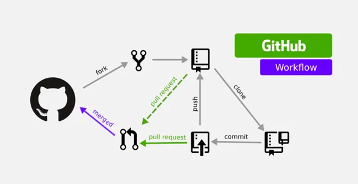

Git & GitHub – Core Commands
==============================

## Workflow: create → track → commit

### 1) Create & Initialize Project
    -  git init "folder_name"
------------------------------

### 2) Create Project Files
    -    touch README.md
    -    touch main.py
-----------------------------

### 3) Check Repository Status
    -    git status
-----------------------------

### 4) Stage Files
    -    git add .
    -    git add README.md     #(Or stage specific files)
-----------------------------

### 5) Commit Changes
    -    git commit -m"Initialize project structure"
-----------------------------

### 6) Daily Git Workflow
    -    git status
    -    git add .
    -    git commit -m "Describe what changed"
-----------------------------

### 7) Create Branch for Main / Master Branch

    - git branch                    #(show all existing branches)
    - git branch branch_name        #(create a new branch)
    - git checkout branch_name      #(switch to the branch)
    - git merge branch_name         #(merge branch into current branch)
-----------------------------

### 8) Connect Local Repo to GitHub 
#### 1- Create a repository on GitHub
        - Go to GitHub → New Repository
#### 2- Link local repository to GitHub
        - git remote add origin https://github.com/USERNAME/REPO_NAME.git
        - git remote -v          # verify remote repository
#### 3- Ensure correct branch name (recommended)
        - git branch -M main     # rename branch to match GitHub default
#### 4- Push local project to GitHub
        - git push -u origin main
------------------------------------------

GitHub Team Workflow (Summary)
==============================

1) Internal / Write Access:
    - Clone the repository
    - Create a branch for your feature or fix
    - Make changes and commit locally
    - Push your branch to the remote repository
    - Open a Pull Request for review and automated checks
    - Merge the branch after approval and delete it

2) External / No Write Access:
    - Fork the repository on GitHub
    - Clone your fork locally
    - Add the original repository as upstream
    - Create a branch for your work
    - Commit changes and push to your fork
    - Open a Pull Request to the original repository for review

Golden Rules:
- Never push directly to the main branch
- One feature per branch
- Keep commits and Pull Requests clear and descriptive
- Resolve conflicts before merging
